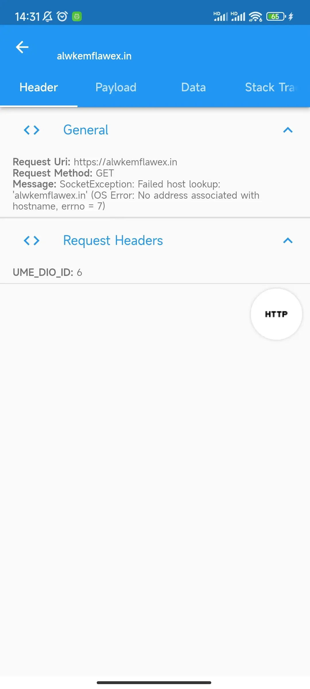
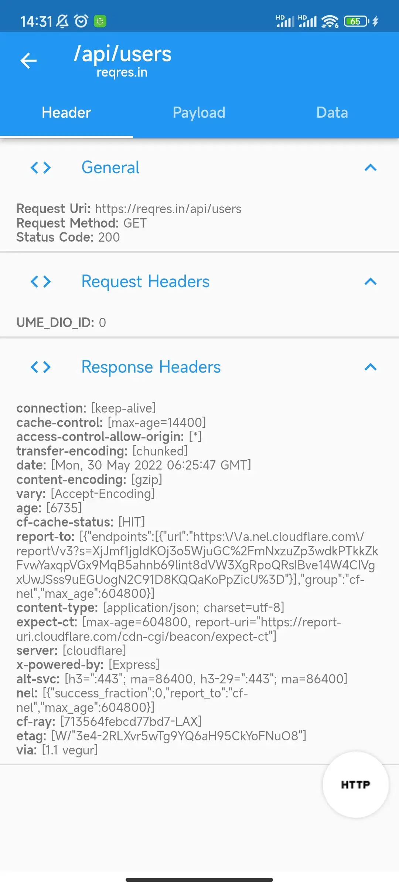
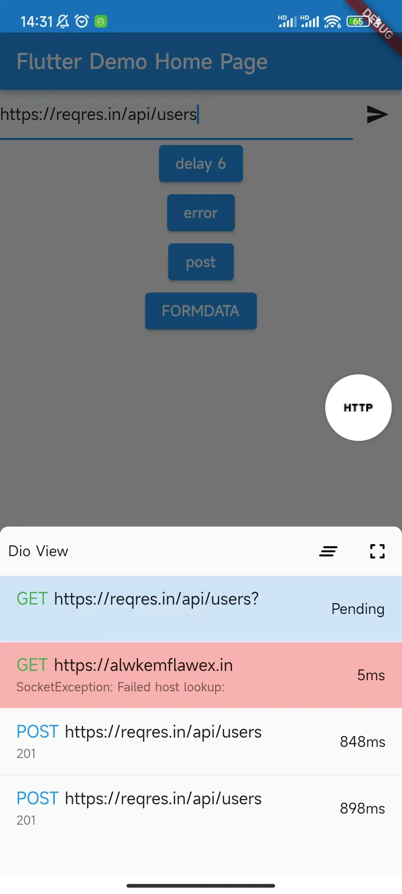

# Dio view

provide a view for [dio](https://github.com/flutterchina/dio).

## Feature

- [x] Request View.
- [x] Error View, includes `stack trace`.
- [x] Support `FormData`.
- [x] Time consuming.
- [x] provider a well json data preview base on [json_view](https://github.com/laiiihz/json_view).

## packages

* [dio_view](packages/dio_view) the main package.
* [dio_view_ume_adapter](packages/dio_view_ume_adapter) dio_view that integrated with `flutter_ume`.

## Preview

* Request List
    > 
* Request Detail 
    > 
* Error Requst 
    > 